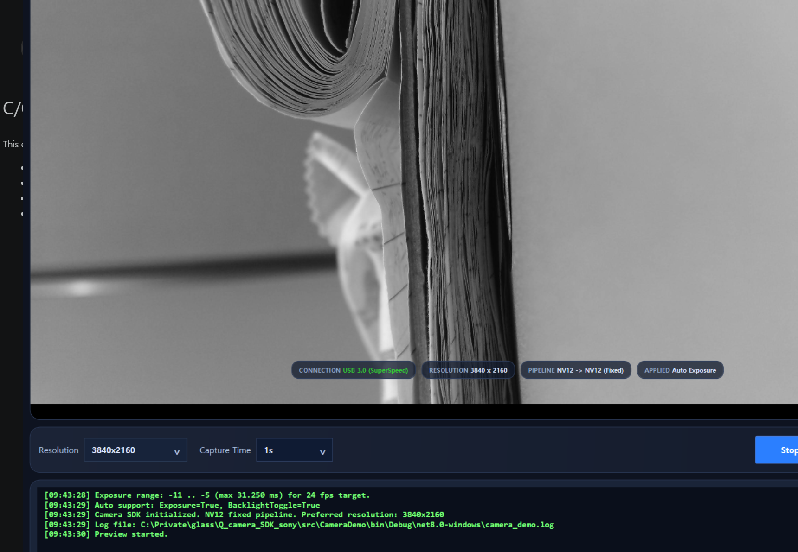

# SDK 사용자 매뉴얼

## 1. 개요
- 대상 장치: Sony 13MP UVC 카메라 모듈
- 운영 정책: `NV12 고정`, `24fps 목표`
- 개발 단계 상태: 1단계 기능 개발 완료

## 2. 구성 요소
- 네이티브 카메라 제어 모듈: `src/CameraCore/CameraCore.cpp`
- 네이티브 헤더: `src/include/CameraSDK.h`
- C# 래퍼: `src/CameraSDK/CameraSDK.cs`
- 데모 애플리케이션: `src/CameraDemo/`
- 검증용 CLI: `src/CameraCli/Program.cs`

## 3. 빌드 방법
```bat
scripts\windows\doctor.cmd
scripts\windows\build_native.cmd
scripts\windows\build_managed.cmd
```

## 4. 실행 방법
```bat
dotnet run --project src/CameraDemo/CameraDemo.csproj -c Debug
```

## 5. 현재 UI 화면
아래 이미지는 현재 `CameraDemo` 실행 화면입니다.



이미지가 보이지 않으면 [원본 이미지 파일](./assets/camera_demo_ui.png)을 직접 열어 확인할 수 있습니다.

- 이미지 파일 경로: `docs/assets/camera_demo_ui.png`
- 화면 정의 파일: `src/CameraDemo/MainWindow.xaml`
- 화면 동작 로직: `src/CameraDemo/MainWindow.xaml.cs`

## 6. 화면 구성
### 6-1. 상단 프리뷰 영역
- 카메라 실시간 영상을 표시합니다.
- 중앙 오버레이로 `REC`, `SAVING...`, `PREVIEW STOPPED`, 경고 문구를 표시합니다.
- 상태 요약으로 연결 상태, 해상도, 파이프라인, 현재 적용 상태를 표시합니다.
- 관련 코드 경로:
  - `src/CameraDemo/MainWindow.xaml`
  - `src/CameraDemo/MainWindow.xaml.cs`

### 6-2. 녹화/해상도 제어 영역
- `Resolution`: 해상도 선택
- `Capture Time`: 녹화 시간 선택
- `Start Preview / Stop Preview`: 프리뷰 시작 및 정지
- `Record`: 메모리 큐 기반 녹화 시작 및 종료
- 관련 코드 경로:
  - `src/CameraDemo/MainWindow.xaml.cs`
  - `src/CameraCore/CameraCore.cpp`

### 6-3. 카메라 제어 영역
- `Auto Exposure (AEC)`: 자동 노출 사용 여부
- `Exposure`: 수동 노출 값 조정
- `Gain`: 수동 게인 값 조정
- `Focus`: 자동/수동 초점 제어
- `Brightness`, `Contrast`, `Saturation`, `Sharpness`, `Backlight`: ProcAmp 제어
- 관련 코드 경로:
  - `src/CameraDemo/MainWindow.xaml.cs`
  - `src/CameraSDK/CameraSDK.cs`
  - `src/CameraCore/CameraCore.cpp`

### 6-4. 로그 및 저장 영역
- 하단 로그 창에 동작 이력과 경고를 기록합니다.
- `Convert & Save All to Folder`로 녹화 프레임을 일괄 저장합니다.
- 관련 코드 경로:
  - `src/CameraDemo/MainWindow.xaml.cs`

## 7. 주요 동작 규칙
- `AEC ON` 상태에서는 `Exposure`, `Gain` 수동 변경이 잠깁니다.
- `AEC OFF`로 전환하면 마지막 수동 `Exposure`, `Gain` 값으로 즉시 복귀합니다.
- `AEC ON` 상태에서는 녹화 시작이 차단됩니다.
- 녹화 중에는 자동 초점과 자동 노출 대신 수동 기준값으로 잠급니다.
- 사용자가 직접 `Stop Preview` 하지 않은 상태에서는 해상도 변경이 차단됩니다.

## 8. 주요 기능 설명
### 8-1. 프리뷰
- 앱 시작 후 자동으로 프리뷰를 시작할 수 있습니다.
- 프리뷰 상태는 상단 오버레이와 상태 표시 텍스트로 확인할 수 있습니다.
- 관련 코드 경로:
  - `src/CameraDemo/MainWindow.xaml.cs`
  - `src/CameraCore/CameraCore.cpp`

### 8-2. 녹화
- 녹화는 메모리 큐 방식으로 수행합니다.
- 녹화 시간은 `Capture Time`에서 설정합니다.
- 첫 프레임 수신 시점부터 실제 녹화 시간이 계산됩니다.
- 관련 코드 경로:
  - `src/CameraDemo/MainWindow.xaml.cs`

### 8-3. 저장
- 녹화가 끝난 뒤 `Convert & Save All to Folder`로 JPEG/PNG/BMP 저장이 가능합니다.
- 저장 중에는 메뉴를 잠그고, 진행률을 화면 중앙에 표시합니다.
- 저장할 데이터가 없으면 저장을 차단하고 로그를 남깁니다.
- 관련 코드 경로:
  - `src/CameraDemo/MainWindow.xaml.cs`

### 8-4. Sharpness 검증
- CLI에서 `--dump-procamp`로 Sharpness 지원 범위를 확인할 수 있습니다.
- CLI에서 `--probe-sharpness`로 Sharpness 값 변화에 따른 edge metric 변화를 확인할 수 있습니다.
- 관련 코드 경로:
  - `src/CameraCli/Program.cs`
  - `src/CameraSDK/CameraSDK.cs`
  - `src/CameraCore/CameraCore.cpp`

## 9. 로그 파일
- 애플리케이션 로그: `src/CameraDemo/bin/Debug/net8.0-windows/camera_demo.log`
- 하드웨어 capability 로그: `src/CameraDemo/bin/Debug/net8.0-windows/hardware_capabilities.log`

## 10. 문제 해결
### 10-1. 카메라 초기화 실패 (`0x80070005`)
- 다른 카메라 앱이 장치를 점유 중인지 확인합니다.
- Windows 카메라 권한이 허용되어 있는지 확인합니다.
- USB를 다시 연결한 뒤 재시도합니다.

### 10-2. 녹화가 시작되지 않는 경우
- `AEC ON` 상태인지 확인합니다.
- 프리뷰가 먼저 시작되어 있는지 확인합니다.
- 상태 표시의 FPS와 파이프라인 조건이 맞는지 확인합니다.

### 10-3. Sharpness 검증이 필요할 때
```bat
dotnet run --project src/CameraCli/CameraCli.csproj -c Debug -- --mode nv12 --width 3840 --height 2160 --dump-procamp

dotnet run --project src/CameraCli/CameraCli.csproj -c Debug -- --mode nv12 --width 3840 --height 2160 --probe-sharpness
```

## 11. 문서 검토 시 우선 확인할 코드 경로
- UI 레이아웃: `src/CameraDemo/MainWindow.xaml`
- UI 동작 및 저장/녹화/AEC 로직: `src/CameraDemo/MainWindow.xaml.cs`
- CLI 검증 로직: `src/CameraCli/Program.cs`
- C# SDK 래퍼: `src/CameraSDK/CameraSDK.cs`
- 네이티브 카메라 제어: `src/CameraCore/CameraCore.cpp`
- 네이티브 API 선언: `src/include/CameraSDK.h`